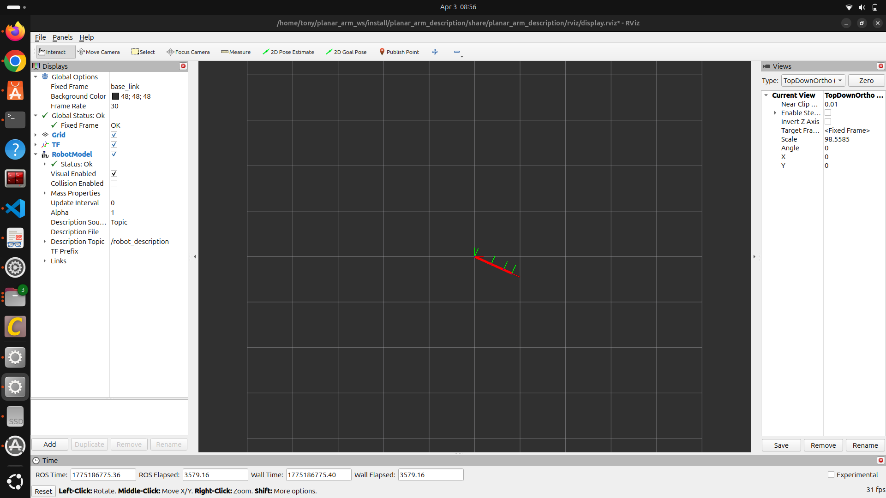
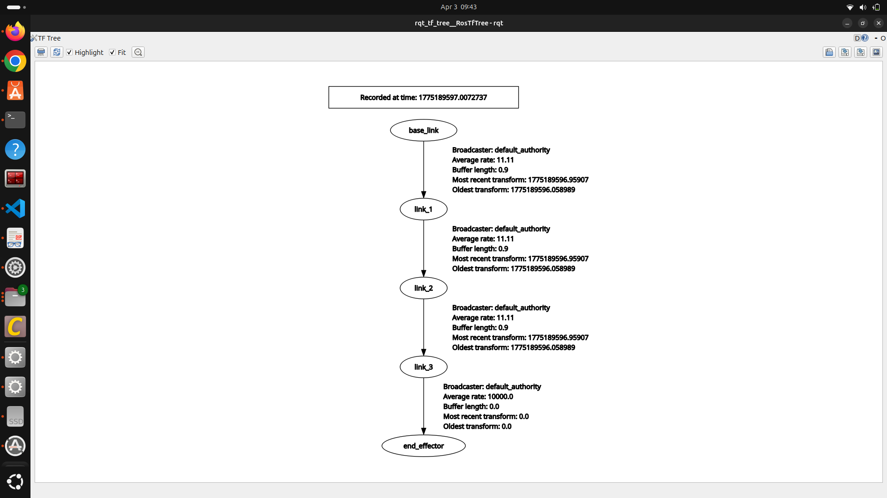
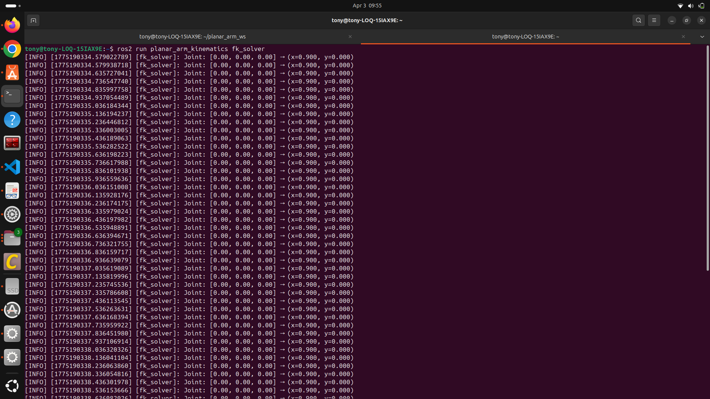
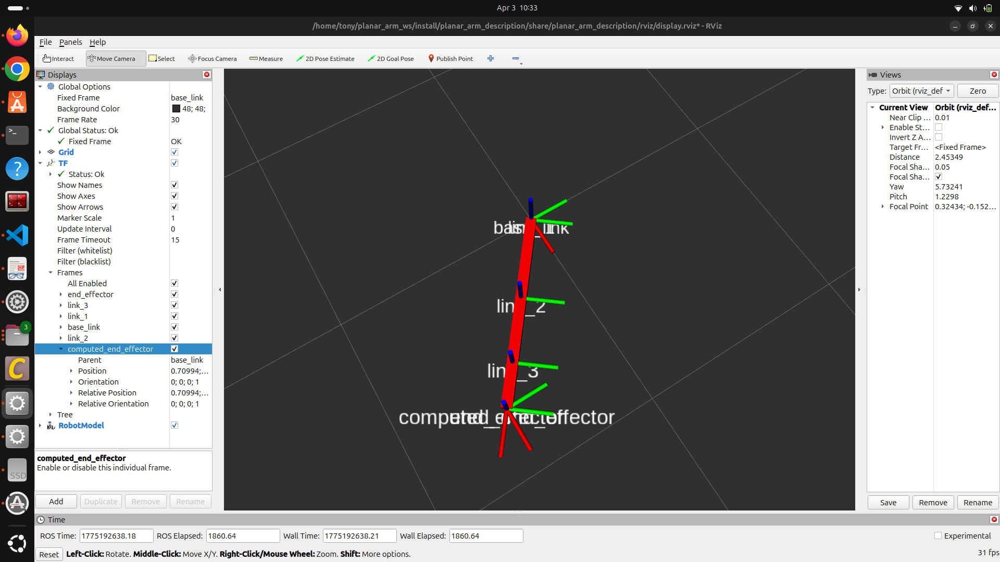
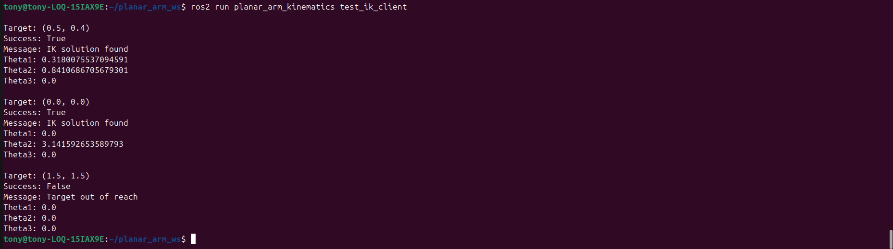

# ROS 2 Planar Arm — Technical Assignment

##  Overview

This project implements a 3-DOF planar robotic arm in ROS 2, including URDF modeling, forward kinematics (FK), inverse kinematics (IK), and TF visualization.

---

## Robot Specifications

* Link 1 (L1): 0.4 m
* Link 2 (L2): 0.3 m
* Link 3 (L3): 0.2 m
* Joint Type: Revolute
* Motion: 2D planar (XY plane)

---

## Build Instructions

```bash
cd ~/planar_arm_ws
colcon build
source install/setup.bash
```

---

## Run

```bash
ros2 launch planar_arm_description display.launch.py
ros2 run planar_arm_kinematics fk_solver
ros2 run planar_arm_kinematics ik_solver
```

---

# Screenshots

## Task 1 — RViz Visualization



## Task 1 — TF Tree



## Task 2 — FK Output



## Task 2 — FK TF Frame



## Task 3 — IK Output



---

# Conceptual Questions

## 1. Forward vs Inverse Kinematics

Forward kinematics computes the end-effector position from given joint angles, while inverse kinematics computes the joint angles required to reach a desired position. FK is straightforward and always has a unique solution, whereas IK may have multiple or no solutions. Real robots use IK for motion planning and FK for state estimation and visualization. In this project, FK was used to compute the end-effector position, and IK was used to calculate joint angles for a given target.

---

## 2. Kinematic Singularity

A kinematic singularity occurs when the robot loses degrees of freedom, typically when its links become collinear. At this point, small changes in position can cause large changes in joint angles, making the system unstable. In this project, singularities occur when the arm is fully stretched or folded. These were handled by clamping values and adding safeguards to prevent numerical errors.

---

## 3. ROS 2 TF System

The ROS 2 TF system maintains spatial relationships between coordinate frames. In this project, the computed_end_effector frame was broadcast using forward kinematics. This allows RViz and other nodes to visualize the robot’s state. A correct TF tree is important because incorrect transformations can lead to wrong visualization and planning errors.

---

## 4. Motion Planning Difference

Motion planning for a differential-drive robot is done in workspace (x, y) and considers obstacles and movement constraints. In contrast, a robotic arm plans in joint space using joint angles and kinematic constraints. Mobile robots use path planning algorithms, while robotic arms rely on IK and trajectory planning. Thus, mobile robots operate in physical space, while arms operate in configuration space.

---

## 5. 6-DOF IK Challenges

A 6-DOF arm introduces additional complexity such as handling both position and orientation. The IK problem becomes nonlinear and may have multiple solutions. Singularities are more complex, and closed-form solutions are often not possible. Numerical methods like Jacobian-based approaches are typically used to solve IK in such systems.

---

# Summary

This project demonstrates a complete ROS 2 pipeline including modeling, kinematics, TF handling, and service-based control for a planar robotic arm.
